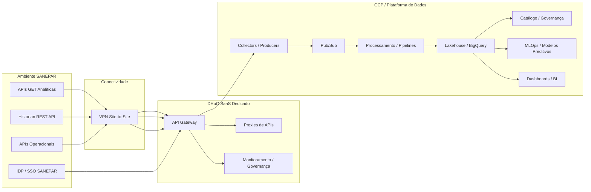

# Dossiê Técnico Consolidado – Projeto SANEPAR Dados & IA

**Data de consolidação:** 24/07/2026  
**Responsável pela consolidação:** Luiz Henrique Gomes De Souza / Microsoft 365 Copilot  
**Critério de elaboração:** conteúdo consolidado a partir das informações já levantadas no Microsoft 365, incluindo arquivos, chats do Teams e registros de reuniões pesquisados durante a conversa.  
**Observação importante:** este documento separa fatos encontrados nas fontes de inferências técnicas. Onde não havia confirmação explícita nas fontes, o conteúdo foi marcado como ponto em aberto ou recomendação.

---

## 1. Sumário Executivo

O projeto SANEPAR está relacionado à implantação de uma solução integrada de dados, APIs, analytics e inteligência artificial em ambiente GCP, tendo como base a proposta técnica do Pregão Eletrônico PE 1050/2026. A proposta menciona uma solução integrada de análise de dados de telemetria em nuvem, com foco em integração, processamento, governança e consumo analítico dos dados de telemetria e sistemas correlatos da SANEPAR.  
**Fontes:** turn8search71, turn8search72

O DHuO aparece como componente central da arquitetura, assumindo o papel de plataforma de gestão e governança de APIs. Em chats técnicos, a SANEPAR esclareceu que pretende utilizar o DHuO como plataforma padrão de gestão de APIs para seu ambiente, inclusive porque atualmente não possui ferramenta centralizada com essa finalidade.  
**Fonte:** turn8search43

A arquitetura discutida no projeto se divide, de forma prática, em duas grandes esteiras: uma esteira analítica, focada nas APIs GET que alimentarão dashboards, lakehouse e modelos de Machine Learning; e uma esteira de proxies/gateway, focada na publicação e governança das demais APIs no DHuO.  
**Fonte:** turn8search43

---

## 2. Escopo Geral do Projeto

### 2.1 Objeto técnico

A proposta técnica localizada descreve a contratação de uma solução integrada de análise de dados de telemetria em nuvem, em aderência ao Termo de Referência, edital e esclarecimentos do PE 1050/2026.  
**Fonte:** turn8search71

A solução foi concebida para atender necessidades de:

- integração de dados;
- processamento;
- governança;
- consumo analítico;
- separação entre ambiente on-premises da SANEPAR e plataforma em nuvem.  
**Fonte:** turn8search71

### 2.2 Componentes explicitamente associados ao projeto

Foram encontrados registros sobre os seguintes componentes e frentes:

- DHuO como API Gateway / plataforma de gestão de APIs;  
  **Fonte:** turn8search43
- GCP como ambiente cloud da solução;  
  **Fontes:** turn8search45, turn8search71
- Pub/Sub como alternativa ou padrão em validação para ingestão e consumo de dados;  
  **Fonte:** turn8search63
- dashboards operacionais;  
  **Fontes:** turn8search60, turn8search63
- modelos preditivos e MLOps;  
  **Fonte:** turn8search63
- governança de dados e catálogo;  
  **Fonte:** turn8search63
- migração de base histórica;  
  **Fonte:** turn8search63
- conectividade VPN entre SANEPAR e ambiente do projeto;  
  **Fontes:** turn8search45, turn8search51, turn8search60

---

## 3. Contexto de APIs e DHuO

### 3.1 Papel do DHuO

Em reunião técnica registrada no Teams, a SANEPAR esclareceu que o objetivo central do módulo DHuO é adotá-lo como plataforma padrão de gestão de APIs no ambiente da empresa. O registro indica que todas as APIs da SANEPAR, independentemente do método HTTP, devem passar pelo DHuO para governança, controle de acessos, monitoração de volumetria e throughput.  
**Fonte:** turn8search43

### 3.2 Volume de APIs

A SANEPAR confirmou que o número de 150 APIs foi dimensionado para cobrir a camada geral de APIs que pretende gerir no DHuO. Nem todas essas APIs serão usadas para extração de dados analíticos.  
**Fonte:** turn8search43

### 3.3 APIs analíticas versus proxies operacionais

Foi registrada a distinção técnica entre:

1. **APIs analíticas:** principalmente APIs GET, associadas ao bloco inicial de dados de telemetria, usadas para dashboards e modelos de ML.  
   **Fonte:** turn8search43
2. **APIs operacionais / proxies:** demais APIs, a serem cadastradas como proxies ou pass-through no DHuO, com foco em monitorar e governar consumo.  
   **Fonte:** turn8search43

### 3.4 Quantidade inicial de APIs analíticas

Nos chats foi registrada a expressão aproximadamente 21 APIs de telemetria no bloco inicial de dados para a esteira analítica.  
**Fonte:** turn8search43

### 3.5 Escopo de construção de APIs

Foi reforçado internamente que o projeto deve consumir APIs existentes e interfaces disponibilizadas pela SANEPAR, sem integração direta com dispositivos OT/SCADA em nível de controle. Também foi registrado que não há margem no projeto para construção de APIs novas ou cenários complexos de conectividade.  
**Fonte:** turn8search48

---

## 4. Esteiras Arquiteturais

## 4.1 Esteira Analítica

A esteira analítica contempla o consumo das APIs GET relevantes para:

- Design Sprint;
- modelagem lakehouse;
- dashboards;
- modelos de ML;
- ingestão de dados;
- processamento em streaming;
- carga histórica.  
**Fontes:** turn8search43, turn8search63

### Responsabilidades associadas nos chats

Foram registradas atividades de dados com responsáveis ou nomes associados:

- Ingestão Streaming: Diego;  
  **Fonte:** turn8search63
- Migração da base histórica: Davi / Diego;  
  **Fonte:** turn8search63
- MLOps + pipelines: Evair;  
  **Fonte:** turn8search63
- Modelos preditivos: Evair;  
  **Fonte:** turn8search63
- Governança de Dados + Catálogo: Pablo / José Jorge.  
  **Fonte:** turn8search63

## 4.2 Esteira de Proxies DHuO

A esteira de proxies tem como foco configurar e publicar as demais APIs no DHuO para governança, monitoramento, autenticação, controle de consumidores e gestão de tráfego, sem exigir engenharia de dados complexa.  
**Fonte:** turn8search43

### Critério de aceite sugerido nos chats

Nos registros de chat, foi sugerido que, para evitar atraso por falta de documentação interna das APIs operacionais da SANEPAR, os critérios de aceite da publicação de proxies no DHuO sejam limitados à verificação de conectividade e autenticação do endpoint.  
**Fonte:** turn8search43

---

## 5. Arquitetura Técnica Consolidada

### 5.1 Visão macro baseada nos registros encontrados

A proposta técnica e os diagramas de pré-venda (`forge/customers/sanepar/pre-sales/`) detalham a arquitetura de referência:

| Diagrama | Conteúdo |
|----------|----------|
| `Arquitetura_Sanepar_Dados_OT_v2 5.png` | Visão integrada: on-prem → VPN → **DHuO API Manager** → GCP (ingestão, lakehouse B/S/G, Dataplex, Vertex ML/GenAI, Looker) |
| `Sanepar_ZoomIN_Ingestao_v2 2.png` | Streaming gerenciado Pub/Sub → Dataflow → Kafka Confluent (TR 4.1.4) |
| `Sanepar_ZoomIN_ETL_v2 2.png` | Composer → Dataproc → dbt Core → BigQuery (TR 4.1.5) |
| `PT_Sanepar_PE1050_Engineering_v7 1.docx` | Proposta técnica (05/05/2026) — DHuO + GCP + Looker + K8s |
| `ENG_Alinhamento_Inicial_SANEPAR_PTBR.pdf` | Mobilização pós-contrato (assinado 30/06/2026), equipe, inventário ~150 APIs |

Catálogo: [`../pre-sales/manifest.yaml`](../pre-sales/manifest.yaml) · Stack: [`../pre-sales/architecture-stack.yaml`](../pre-sales/architecture-stack.yaml)

---

## 5.2 Cronograma preliminar (MS Project / CRN V0)

Fonte: [`../timeline/CRN_ENG_OBS_SANEPAR_V0 1.xml`](../timeline/CRN_ENG_OBS_SANEPAR_V0%201.xml) (MSPDI, 278 tasks) · resumo: [`../timeline/schedule-summary.yaml`](../timeline/schedule-summary.yaml).

| Item | Valor |
|------|-------|
| Rótulo WBS | `SANEPAR_PRELIMINAR_1050/26` |
| Janela | 2026-07-01 → 2027-03-24 (execução até 2027-01-26) |
| Status | Preliminar — esforço/prazos especulativos até Design Sprint |
| Escopo APIs no CRN | 21 mandatórias (5 dashboards + 2 ML) + 129 proxies ≈ 150 |
| Design Sprint D1–D5 | 2026-08-10 → 2026-08-19 |

**Frentes de execução (pós Design Sprint):**

| Frente | Janela | Oferta Eng |
|--------|--------|-------------|
| Discovery e Arquitetura | 2026-08-19 → 2026-09-03 | — |
| Ingestão e Pipelines | 2026-09-04 → 2026-10-05 | data-journey |
| Integração e APIs (DHuO) | 2026-10-06 → 2026-11-13 | api-journey |
| Integração & MLOps | 2026-11-16 → 2026-12-07 | ai-journey |
| Governança e Segurança | 2026-12-08 → 2026-12-18 | data-journey |
| BI e Analytics | 2026-12-21 → 2027-01-04 | ai-journey |
| QA e Go Live | 2027-01-05 → 2027-01-26 | — |

Nota: metadados do XML herdam template HEKTOR/Accenture; o conteúdo de projeto é SANEPAR PE 1050/26.

```text
Fontes SANEPAR expostas por APIs
        │
        ▼
DHuO - API Gateway / Gestão de APIs  ← API Journey
        │
        ├── Esteira de Proxies / Governança
        │       └── Cadastro, autenticação, monitoramento e controle de uso
        │
        └── Esteira Analítica - APIs GET
                │
                ▼
        Camada de Coleta / Producers
                │
                ▼
        Pub/Sub → Dataflow → Kafka (Confluent)
                │
                ▼
        Composer / Dataproc / dbt → Lakehouse Bronze/Silver/Gold (GCS + BigQuery)
                │
                ├── Looker (dashboards)
                ├── Vertex AI / MLOps (2 modelos)
                └── GenAI controlada (guardrails)
```

**Status:** a presença do Pub/Sub aparece nos registros como ponto a confirmar ou solução padrão em avaliação para ingestão e consumo dos dados. A arquitetura acima é uma consolidação técnica coerente com o que foi discutido, mas a decisão formal sobre Pub/Sub deve ser validada no projeto.  
**Fonte:** turn8search63

### 5.2 Ponto de atenção sobre escopo OT/SCADA

Foi registrado que o consumo será via APIs existentes, sem atuação direta em CLPs, RTUs ou SCADA operacional. Esse ponto evita interpretação equivocada de que a solução fará integração em nível de controle industrial.  
**Fonte:** turn8search48

### 5.3 Nomenclatura recomendada para fontes

Rudinei sugeriu ajustar o termo “sistemas legados on-prem” para algo como “fontes corporativas e operacionais já expostas por APIs”, para manter coerência com a proposta e evitar escopo implícito.  
**Fonte:** turn8search48

---

## 6. Historian REST API

### 6.1 Documento localizado

Foi localizado o documento **SANEPAR-HISTORIAN-REST-API.docx.pdf**, compartilhado por Oswaldo Augusto Pelegrina em thread do Teams relacionada à definição final das atividades.  
**Fonte:** turn8search21

### 6.2 Objetivo funcional da API

O documento descreve a **Historian Rest API** e apresenta o fluxo em três etapas:

1. registro do dispositivo/equipamento na base da SANEPAR;
2. cadastro da Tag/Ponto associada ao dispositivo/equipamento;
3. envio dos dados de telemetria associados ao UIDTAG.  
**Fonte:** turn8search21

### 6.3 Ambientes e autenticação

O documento registra URL de homologação/staging e URL de produção da API, além de autenticação por API Key no header `user-key`.  
**Fonte:** turn8search21

### 6.4 Papel provável no projeto

**Fato confirmado:** a API documenta fluxo de dispositivo, tag/ponto e medições de telemetria.  
**Fonte:** turn8search21

**Inferência técnica:** considerando que os chats tratam as APIs GET como base para dashboards e ML, a Historian REST API provavelmente é uma das fontes candidatas para ingestão analítica. Essa conexão precisa ser validada, pois os registros encontrados não afirmam explicitamente que ela é a única fonte ou que substitui as demais APIs de telemetria.

---

## 7. Dados, Volumetria e Sizing

### 7.1 Volumetria citada em planilha e chats

Em registros de precificação e discussão de sizing, foram encontrados os seguintes números:

- 45 milhões de chamadas por mês associadas à telemetria atual;  
  **Fonte:** turn8search82
- 1.600 USNs/mês como previsão de consumo máximo;  
  **Fonte:** turn8search82
- 15 usuários/ano para BI, com menção a Looker ou Power BI;  
  **Fonte:** turn8search82
- 30 milhões de medições históricas atuais;  
  **Fonte:** turn8search62
- carga histórica inicial estimada em **1,5 GB**;  
  **Fonte:** turn8search62 / tabela Teams (evidência `volumetria-5anos.png`)

#### Projeção acumulada em 5 anos (evidência Teams)

| Item | Carga histórica | Mensal | Y1 | Y2 | Y3 | Y4 | Y5 |
|------|----------------:|-------:|---:|---:|---:|---:|---:|
| Carga histórica (inicial) — ~30 mi medições | 1,5 GB | — | 1,5 GB | 1,5 GB | 1,5 GB | 1,5 GB | 1,5 GB |
| Geração — cenário atual (1.352 equipamentos) | — | ~8,1 GB | 97,2 GB | 194,4 GB | 291,6 GB | 388,8 GB | **486,0 GB** |
| Geração — cenário expansão (5.000 equipamentos) | — | ~34,5 GB | 414,0 GB | 828,0 GB | 1.242,0 GB | 1.656,0 GB | **2.070,0 GB** |

**Leitura:** histórico inicial é pequeno (1,5 GB); no cenário atual a base cresce ~0,5 TB em 5 anos; na expansão (~5 mil equipamentos) a arquitetura precisa comportar **~2 TB** acumulados no Y5 (sem contar outras camadas).

### 7.2 Crescimento do parque

Foi registrada discussão informando que a proposta começaria com aproximadamente 2 mil pontos de medição, mas a SANEPAR sinalizou que já estaria próxima de 5 mil pontos, que era a previsão final.  
**Fonte:** turn8search62

### 7.3 Implicação técnica

**Inferência técnica:** a arquitetura deve nascer escalável e monitorada desde o início, mas com deploy inicial no menor tier possível, aumentando recursos conforme evolução do projeto e consumo real. Essa abordagem foi coerente com o registro de conversa sobre subir um deploy padrão do produto e fazer fine tuning durante o projeto, monitorando para não estourar USNs.  
**Fonte:** turn8search62

---

## 8. Dashboards e BI

### 8.1 Quantidade de dashboards

Foi citado que o projeto contempla 5 dashboards e 2 modelos de ML.  
**Fonte:** turn8search43

### 8.2 Operação em centro de controle

Em daily de atividades foi registrado que os dashboards operacionais serão expostos no centro de controle.  
**Fonte:** turn8search60

### 8.3 Looker, Power BI e licenciamento

A planilha de preços e ações menciona Looker ou Power BI para BI, com 15 usuários/ano. Também há observação de problema com SSO no Looker e sugestão de trocar por Power BI, além de envolver Ingram e Priscila.  
**Fonte:** turn8search82

Em chat posterior, Anderson comentou que, em conversa com a Google, foi sinalizado que as 15 licenças contratadas precisariam poder ser embeddadas em portais da SANEPAR e que isso seria um tipo específico de licença.  
**Fonte:** turn8search61

Heinrich destacou que licenciamento avulso precisaria vir por compras, e também que seria necessário entender como funcionam essas licenças.  
**Fonte:** turn8search61

---

## 9. Cloud, Infraestrutura e Conectividade

### 9.1 GCP e landing zone

Nos chats foi registrado que a SANEPAR já possui GCP com landing zone e alguns componentes, sendo necessário alinhar acessos, criações e conectividade.  
**Fonte:** turn8search45

### 9.2 VPN

A criação do túnel VPN com a SANEPAR foi tratada como ponto de alinhamento técnico prioritário.  
**Fonte:** turn8search45

Em conversa de definição macro de atividades, foi mencionado que antes de disponibilizar o formulário de VPN seria necessário terminar a infra de rede do lado Engineering, incluindo criação de VPC, definição de subnet, peer e rede.  
**Fonte:** turn8search51

Em daily, foi registrado que o setup Cloud na GCP estava pronto do lado do time, faltando o fechamento da VPN pelo cliente.  
**Fonte:** turn8search60

### 9.3 DHuO SaaS

Em chat do projeto foi perguntado se o DHuO seria SaaS ou self-hosted, e Anderson respondeu “SaaS”.  
**Fonte:** turn8search45

### 9.4 Instalação e configuração do DHuO

Em conversa direta, Flavia informou que instalação e configuração do DHuO seria feita pelo time de cloud, associado a Heinrich.  
**Fonte:** turn8search49

A configuração lógica do produto, como criar APIs e integrações, foi associada a um time com 2 QAs, 1 dev Jr e 1 GP, segundo resposta de Flavia.  
**Fonte:** turn8search49

---

## 10. DevOps, CI/CD e Observabilidade

Na daily do projeto foram listadas atividades relacionadas a DevOps e operação:

- criação de pipelines;
- configuração de clusters Kubernetes;
- configuração Git e Cloud Build / Artifact Registry;
- Infra as Code;
- observabilidade dos ELK;
- operação e deploys.  
**Fonte:** turn8search60

Heinrich indicou que essas atividades seriam com a pessoa alocada de DevOps e solicitou envolver o recurso.  
**Fonte:** turn8search60

---

## 11. Dados, Streaming e Migração Histórica

### 11.1 Atividades de ingestão streaming

Foram registradas as seguintes atividades para ingestão streaming:

- levantamento de eventos e fontes de dados;
- definição da arquitetura de streaming;
- configuração dos tópicos/filas;
- desenvolvimento dos consumidores e produtores;
- tratamento de erros e reprocessamento;
- monitoramento e observabilidade;
- testes de performance e carga;
- homologação da ingestão.  
**Fonte:** turn8search63

### 11.2 Migração da base histórica

Foram registradas as seguintes atividades para migração da base histórica:

- inventário dos dados históricos;
- estratégia de migração;
- conversão e padronização dos dados;
- desenvolvimento dos scripts de migração;
- cargas piloto;
- validação de consistência;
- migração produtiva.  
**Fonte:** turn8search63

### 11.3 Pub/Sub

O registro da reunião aponta que ainda deveria ser confirmado se o Pub/Sub seria a solução padrão para ingestão e consumo dos dados, ou se outras alternativas deveriam ser avaliadas.  
**Fonte:** turn8search63

**Recomendação técnica:** considerando sua decisão informada durante a conversa de que os dados de GET das APIs serão postados em um tópico Pub/Sub, o desenho lógico deve tratar o Pub/Sub como backbone de desacoplamento entre coleta das APIs e consumidores analíticos. Esta recomendação é derivada da sua orientação e do material do projeto; não é uma confirmação documental independente.

---

## 12. Governança de Dados e Catálogo

A frente de governança de dados e catálogo foi registrada com as seguintes atividades:

- definição de políticas de governança;
- inventário de ativos de dados;
- implantação do catálogo;
- classificação dos dados;
- definição dos proprietários dos dados, ou Data Owners;
- linhagem de dados;
- regras de qualidade;
- capacitação dos usuários.  
**Fonte:** turn8search63

---

## 13. MLOps e Modelos Preditivos

### 13.1 Setup MLOps + pipelines

Foram registradas as seguintes atividades:

- definição da arquitetura MLOps;
- configuração dos ambientes;
- implementação CI/CD;
- versionamento de modelos;
- automação de treinamento;
- automação de deploy;
- monitoramento de modelos;
- gestão de drift e retreinamento.  
**Fonte:** turn8search63

### 13.2 Modelos preditivos

Foram registradas as seguintes atividades:

- definição das variáveis;
- engenharia de atributos;
- desenvolvimento dos modelos;
- treinamento e validação;
- ajustes e otimização;
- implementação produtiva;
- monitoramento da performance.  
**Fonte:** turn8search63

---

## 14. Segurança e Autenticação

O anexo do Termo de Referência registra que a autenticação dos usuários deve ocorrer no ambiente da SANEPAR, por meio do provedor de identidades disponibilizado pelo ambiente de SSO da contratante.  
**Fonte:** turn8search89

O documento menciona o uso de OpenID Connect/OAuth 2.0 ou SAML v2, e proíbe expressamente a utilização do grant type Password para integração com o SSO.  
**Fonte:** turn8search89

Também foi registrado que a senha dos usuários da SANEPAR não deve ser armazenada ou conhecida pela contratada.  
**Fonte:** turn8search89

---

## 15. Testes Integrados, Go-Live e Transferência

### 15.1 Testes integrados

Foram registradas atividades de testes integrados:

- planejamento dos testes;
- elaboração dos cenários;
- testes funcionais;
- testes de integração;
- testes de performance;
- testes de segurança;
- correção dos apontamentos;
- homologação do usuário.  
**Fonte:** turn8search63

### 15.2 Go-Live e transferência

Foram registradas atividades de Go-Live e transferência:

- planejamento da entrada em produção;
- cutover;
- Go-Live assistido;
- estabilização;
- monitoramento inicial.  
**Fonte:** turn8search63

---

## 16. Riscos e Pontos de Atenção

### 16.1 Risco: escopo de APIs sem documentação suficiente

Há risco de atraso caso os contratos técnicos das APIs analíticas GET não sejam disponibilizados de forma suficiente para modelagem, ingestão e dashboards. Esse risco está alinhado ao registro de que os critérios de aceite dos dashboards e modelos de ML dependem do fornecimento dos contratos técnicos das APIs analíticas GET.  
**Fonte:** turn8search43

### 16.2 Risco: misturar aceite analítico com cadastro de proxies

Foi sugerido que o aceite analítico seja desvinculado do cadastro das APIs puramente operacionais no DHuO, evitando que pendências em proxies operacionais travem dashboards e modelos de ML.  
**Fonte:** turn8search43

### 16.3 Risco: conectividade VPN

A conectividade VPN aparece como dependência recorrente em chats e daily. Há registros de necessidade de finalizar VPC, subnet, peer e rede, além de pendência de fechamento da VPN pelo cliente.  
**Fontes:** turn8search51, turn8search60

### 16.4 Risco: sizing e custos ociosos

Foi levantado ponto para entender o timing do contrato antes de subir infraestrutura sem condição de faturar o cliente, evitando custos ociosos. Também foi sugerido subir no menor tier possível e escalar conforme evolução do projeto.  
**Fonte:** turn8search62

### 16.5 Risco: licenciamento Looker / BI

Há pendências sobre tipo correto de licença, possibilidade de embedding em portais da SANEPAR, responsabilidade pela aquisição e eventual alternativa Power BI.  
**Fontes:** turn8search61, turn8search82

### 16.6 Risco: definição incompleta dos dashboards e ML

O Facilitator registrou que já havia clareza sobre APIs principais e fluxo de dados para o primeiro painel, mas ainda faltavam definições para os demais painéis e modelos de ML.  
**Fonte:** turn8search63

---

## 17. Decisões em Aberto / Perguntas para SANEPAR

### 17.1 APIs e dados

1. Quais são exatamente as ~21 APIs GET que alimentarão a esteira analítica?
2. Qual o contrato técnico de cada API GET?
3. Qual a periodicidade de atualização esperada para cada fonte?
4. Qual volumetria real por API?
5. Quais APIs serão usadas no primeiro dashboard?
6. Quais APIs serão necessárias para os demais dashboards e modelos de ML?

**Base:** dúvidas sobre periodicidade, volumetria, APIs e requisitos funcionais para dashboards foram registradas como pendentes.  
**Fonte:** turn8search63

### 17.2 Pub/Sub e arquitetura de ingestão

1. Pub/Sub será confirmado como mecanismo padrão de ingestão?
2. Haverá um tópico único por domínio ou tópicos por API/fonte?
3. Qual será a estratégia de reprocessamento?
4. Como será registrada a rastreabilidade entre chamada GET, payload recebido e dado processado?

**Base:** confirmação do Pub/Sub como solução padrão foi apontada como ponto pendente.  
**Fonte:** turn8search63

### 17.3 Historian API

1. A Historian REST API é uma das ~21 APIs GET analíticas?
2. Ela é a fonte principal de telemetria ou apenas uma fonte entre outras?
3. Existe acesso direto ao banco histórico ou somente via API?
4. Existe paginação, janela máxima de consulta ou limite de throughput?
5. A Historian API entrega dados incrementais ou somente consultas por janela temporal?

**Base:** o documento localizado define fluxo de dispositivo, tag e medição, mas não esclarece se a API é a única origem de histórico nem se há acesso direto ao banco.  
**Fonte:** turn8search21

### 17.4 Segurança e identidade

1. Qual protocolo será usado na prática para SSO: OIDC/OAuth2 ou SAML v2?
2. Quais claims serão disponibilizadas pelo IDP da SANEPAR?
3. Como será feito o controle de acesso nos dashboards?
4. Como será segregado acesso entre usuários técnicos, operacionais e administradores?

**Base:** o edital registra OIDC/OAuth 2.0 ou SAML v2 e proibição de Password Grant.  
**Fonte:** turn8search89

### 17.5 Conectividade

1. Qual arquitetura final de VPN?
2. Quais subnets e IP ranges serão usados?
3. Quem fornece peers, rotas, firewall e regras?
4. Qual o plano de teste de conectividade?
5. Como será feito failover ou alta disponibilidade da conectividade, se aplicável?

**Base:** chats registram necessidade de VPC, subnet, peer e fechamento da VPN.  
**Fontes:** turn8search51, turn8search60

---

## 18. ADRs Recomendadas

### ADR-001 – Padrão de ingestão analítica

**Decisão proposta:** dados retornados por APIs GET serão publicados em tópicos Pub/Sub para desacoplar a coleta das fontes SANEPAR dos pipelines consumidores.

**Status:** proposta técnica em consolidação; Pub/Sub aparece como solução a confirmar nos registros.

**Motivação:** permitir ingestão assíncrona, reprocessamento, escalabilidade e separação entre coleta, processamento e consumo.

**Fontes relacionadas:** turn8search63

### ADR-002 – Separação entre esteira analítica e esteira de proxies

**Decisão proposta:** separar claramente APIs GET usadas em analytics das demais APIs cadastradas como proxies no DHuO.

**Status:** alinhado com reunião técnica registrada.

**Motivação:** evitar que pendências de APIs operacionais atrasem dashboards e ML.

**Fontes relacionadas:** turn8search43

### ADR-003 – Escopo sem integração direta OT/SCADA

**Decisão proposta:** registrar que a solução consumirá APIs e interfaces expostas pela SANEPAR, sem comunicação direta com CLPs, RTUs ou SCADA operacional.

**Status:** alinhado com recomendação registrada em chat.

**Motivação:** evitar expansão indevida de escopo e risco operacional.

**Fontes relacionadas:** turn8search48

### ADR-004 – Estratégia de infraestrutura elástica

**Decisão proposta:** iniciar com deploy padrão ou menor tier possível e escalar conforme consumo real, mantendo monitoramento de USNs.

**Status:** alinhado com discussão interna.

**Motivação:** evitar custo ocioso e permitir ajuste progressivo do sizing.

**Fontes relacionadas:** turn8search62

---

## 19. Arquitetura Recomendada para Desenho HLD

### 19.1 Diagrama lógico proposto



### 19.2 Observação sobre o diagrama

O diagrama acima inclui Pub/Sub conforme a diretriz informada por Luiz durante a conversa e o ponto de validação registrado nos chats. Ele deve ser tratado como base para HLD, não como arquitetura formalmente aprovada pela SANEPAR.

---

## 20. Backlog Técnico Consolidado

### 20.1 Arquitetura e Discovery

- Validar escopo das APIs GET analíticas.
- Separar APIs de analytics versus proxies.
- Confirmar papel da Historian API.
- Confirmar Pub/Sub como padrão de ingestão.
- Definir domínios de dados.
- Definir estratégia de tópicos.
- Definir modelo de rastreabilidade.

### 20.2 Infraestrutura

- Finalizar VPC e subnets.
- Definir peer e rede.
- Concluir formulário VPN.
- Validar conectividade com SANEPAR.
- Implantar DHuO SaaS dedicado.
- Ajustar sizing conforme consumo real.

### 20.3 Dados

- Inventariar dados históricos.
- Definir estratégia de migração.
- Desenvolver scripts de carga histórica.
- Configurar produtores e consumidores.
- Implementar tratamento de erros e reprocessamento.
- Preparar testes de performance e carga.

### 20.4 BI e Analytics

- Definir KPIs dos 5 dashboards.
- Confirmar ferramenta: Looker ou Power BI.
- Validar licenças e embedding.
- Criar modelo semântico.
- Validar com usuários do centro de controle.

### 20.5 ML / MLOps

- Confirmar objetivos dos 2 modelos preditivos.
- Definir variáveis.
- Preparar features.
- Implementar versionamento de modelos.
- Definir monitoramento de drift.
- Automatizar treinamento e deploy.

### 20.6 Governança

- Catalogar ativos.
- Definir owners.
- Classificar dados.
- Definir regras de qualidade.
- Mapear linhagem.
- Capacitar usuários.

---

## 21. Conclusão

O material levantado indica que o projeto SANEPAR deve ser tratado como uma implantação integrada de gestão de APIs, engenharia de dados, analytics e IA em GCP, com DHuO no centro da governança de APIs. A principal decisão arquitetural para o HLD é separar claramente a esteira analítica, baseada nas APIs GET, da esteira de proxies, voltada à governança das demais APIs.  
**Fontes:** turn8search43, turn8search63

A arquitetura mais coerente com as discussões atuais é usar as APIs GET da SANEPAR como fontes, governá-las pelo DHuO, coletar os dados via camada de producers, publicar em Pub/Sub e alimentar pipelines analíticos para lakehouse, dashboards e modelos preditivos. Essa arquitetura precisa ser formalmente validada porque o Pub/Sub aparece nos registros como ponto a confirmar, e não como decisão final documentada.  
**Fonte:** turn8search63

As principais pendências técnicas estão relacionadas a contratos das APIs GET, periodicidade e volumetria, fechamento da VPN, definição final dos dashboards e modelos de ML, licenciamento de BI e confirmação do papel exato da Historian REST API.  
**Fontes:** turn8search21, turn8search51, turn8search61, turn8search63

---

## 22. Fontes internas utilizadas

- `turn8search21` – Arquivo SANEPAR-HISTORIAN-REST-API.docx.pdf.
- `turn8search43` – Chat [SANEPAR] - ENG - Equipe de Trabalho.
- `turn8search45` – Chat SANEPAR - Projeto de Dados.
- `turn8search48` – Chat [SANEPAR] - Alinhamento Apresentação Solução.
- `turn8search49` – Chat com Flavia sobre configuração DHuO.
- `turn8search51` – Chat [SANEPAR] - Definição Macro Atividades.
- `turn8search60` – Chat [SANEPAR] - Daily Atividades.
- `turn8search61` – Chat SANEPAR - Projeto de Dados / Google / Looker.
- `turn8search62` – Chat [SANEPAR] - Definição Macro Atividades / sizing.
- `turn8search63` – Chat [SANEPAR] - Definição final das atividades.
- `turn8search71` – Arquivo PT_Sanepar_PE1050_EngineeriNG_v1.pdf.
- `turn8search72` – Arquivo PT_Sanepar_PE1050_EngineeriNG_v1.docx.
- `turn8search82` – Arquivo SANEPAR_Preços e Ações.xlsx.
- `turn8search89` – Arquivo ANEXOIITR105026.PDF.
